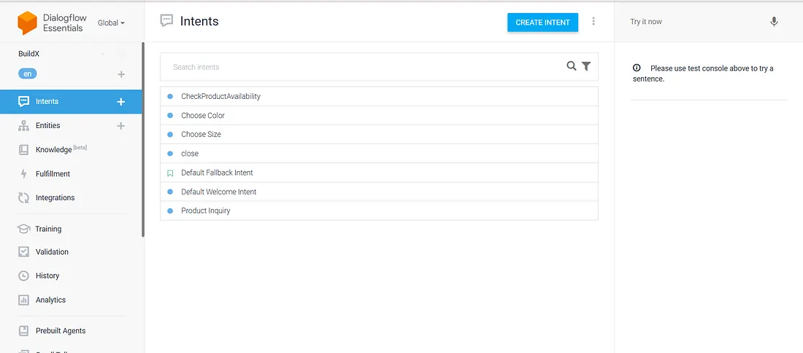

# 🤖 E-Commerce Chatbot with Google Dialogflow + Medusa CMS

An intelligent voice/text chatbot integrated with the **Medusa e-commerce platform**, built using **Google Dialogflow**, **Node.js**, and **PostgreSQL**. This full-stack solution allows users to query product availability, pricing, sizes, and colors via natural language, with responses powered by a dynamic webhook backend.

🛍️ Designed for retail and e-commerce businesses, the bot delivers instant and personalized assistance — replacing traditional search with conversational experience.
> 🧠 **Tech Stack**: Google Dialogflow, Node.js, Medusa.js, PostgreSQL, REST APIs

---

## ✨ Key Features

###  Conversational Product Discovery
- Understands user queries like:
  - “Do you have black kurtis in size M?”
  - “What T-shirts are available?”
- Built using **Google Dialogflow** with support for **intents**, **entities**, and **context-aware flows**.

###  Dynamic Webhook Integration
- A custom **Node.js webhook** connects Dialogflow to the Medusa backend.
- Fetches live product information from Medusa’s `/store/products` API.
- Supports follow-up interactions based on product, size, and color.

###  Medusa CMS Integration
- Connected to a local Medusa e-commerce backend running on PostgreSQL.
- Retrieves products, variants, and inventory in real time.
- Uses Medusa’s **publishable API key** for secure access.

###  Multi-Stage Intent Flow
- **Intent 1: Product Inquiry**  
  Lists all available products via webhook.
- **Intent 2: Check Availability**  
  Fetches size/color options for a selected product.
- **Intent 3: Choose Size**  
  Returns available colors for selected size.
- **Intent 4: Choose Color**  
  Responds with pricing based on selected options.

###  Context-Aware Conversations
- Maintains context across turns using Dialogflow contexts:
  - `product-selection`
  - `size-selection`
- Enables intelligent multi-turn dialogues (e.g., size → color → price).

###  Deployable on Any Platform
- Integrates easily with:
  - Web apps via iframe (Web Demo)
  - WhatsApp, Messenger, Telegram, Google Assistant
- Can be embedded in e-commerce websites for real-time shopping assistance.

---

## 🧩 System Architecture & Workflow

This project integrates **Google Dialogflow** with the **Medusa e-commerce backend** via a custom Node.js webhook. The chatbot receives natural language queries, processes them via Dialogflow, and dynamically responds using Medusa's real-time product data.


### 🔄 Component Flow

```plaintext
User Input (Text/Voice)
       ↓
Dialogflow Intent Recognition
       ↓
Webhook Trigger (/webhook)
       ↓
Node.js Server (index.js)
       ↓
Fetch data from Medusa API (/store/products)
       ↓
Generate Response (availability, sizes, colors, prices)
       ↓
Dialogflow Response → User
```
### 🧠 Intent-Based Logic (Defined in Dialogflow)

| **Intent Name**         | **Purpose**                                               | **Response Source** |
|-------------------------|------------------------------------------------------------|----------------------|
| `product`               | Lists all available products                               | Medusa API           |
| `checking_availability`| Checks variants of a selected product (size and color)     | Medusa API           |
| `Choose Size`           | Returns available colors for the chosen size              | Medusa API           |
| `Choose Color`          | Returns price options for the selected variant            | Medusa API           |
| `Default Fallback`      | Handles unmatched user queries                             | Static Response      |

---
## 🧑‍💻 Technologies Used

| Layer       | Technology                            |
|-------------|----------------------------------------|
| Chatbot     | Google Dialogflow (NLP + Intents)      |
| Backend     | Node.js, Express.js                    |
| CMS         | Medusa.js (e-commerce backend)         |
| Database    | PostgreSQL                             |
| API         | REST API (Medusa store endpoints)      |
| Integration | Webhooks (Dialogflow ↔ Medusa)         |
| Testing     | Ngrok (for public webhook URL)         |

---

## 🔧 Installation & Setup

This project involves 3 components:

1. Medusa e-commerce backend  
2. Dialogflow webhook server (Node.js)  
3. Dialogflow console configuration (intents + webhook URL)

###  1. Clone the Repository

```bash
git clone https://github.com/Sneha1908/E-Commerce-Chatbot.git
cd E-Commerce-Chatbot
```
###  2. Start the Webhook Server (Node.js)

```bash
cd medusa-dialogflow
npm install
node index.js
```
The server will start at:
http://localhost:3001/webhook

###  3. Expose Webhook Using Ngrok

In a new terminal window:

```bash
ngrok http 3001
```
Ngrok will provide a public HTTPS URL like:
https://abcd1234.ngrok.io

Copy this and set it as your Webhook URL inside Dialogflow:
https://abcd1234.ngrok.io/webhook

📌 Go to: Dialogflow Console → ⚙️ Fulfillment → Enable Webhook → Paste URL

###  4. Start the Medusa Backend

```bash
cd ../my-medusa-store
cp .env.template .env
# (Edit the .env file with your PostgreSQL DB credentials and secrets)
yarn install
yarn start
```
Once started, the Medusa backend will be available at:

- Admin Panel: http://localhost:7001/app
- Store API Endpoint: http://localhost:9000/store/products

Make sure to copy the Publishable API Key from the Medusa Admin UI and paste it into your medusa-dialogflow/index.js file:


###  5. Dialogflow Setup

1. Open [Dialogflow Console](https://dialogflow.cloud.google.com)
2. Click **Create Agent** and enter a name like `E-Commerce Chatbot`
3. Create the following **intents**:
   - `product`
   - `checking_availability`
   - `Choose Size`
   - `Choose Color`

4. For **each intent**:
   - Scroll to the bottom
   - ✅ Enable **Webhook Fulfillment**

5. Go to the **Fulfillment** tab:
   - Enable the Webhook switch
   - Paste your **ngrok** URL:

https://abcd1234.ngrok.io/webhook

>  This will allow Dialogflow to call your Node.js server in real-time when users trigger those intents.

---

## 📷 Results

###  Dialogflow Workflow
- **Defined Intents in Console**
  

- **Intent Recognition**
  

- **User Interaction**
  

- **Data Retrieval**
  

- **Response Generation**
  

- **Webhook Trigger**
  

###  Medusa Store

- **Product Listing from Medusa**
  

---

## 👩‍💻 Author

**Sneha S**  
Final Year B.E. Computer Science and Engineering  
Coimbatore Institute of Technology  
GitHub: [@Sneha1908](https://github.com/Sneha1908)
